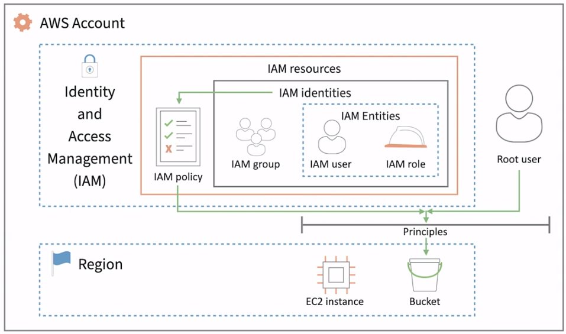
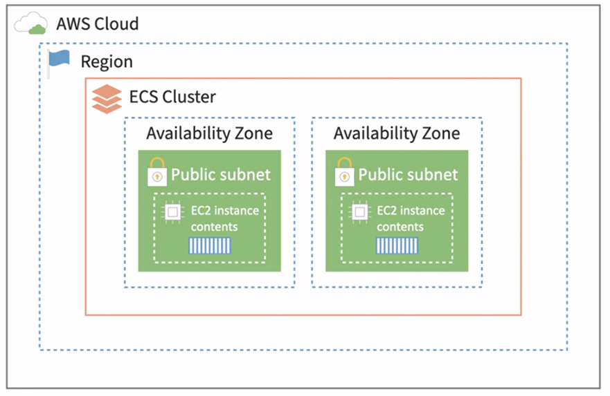
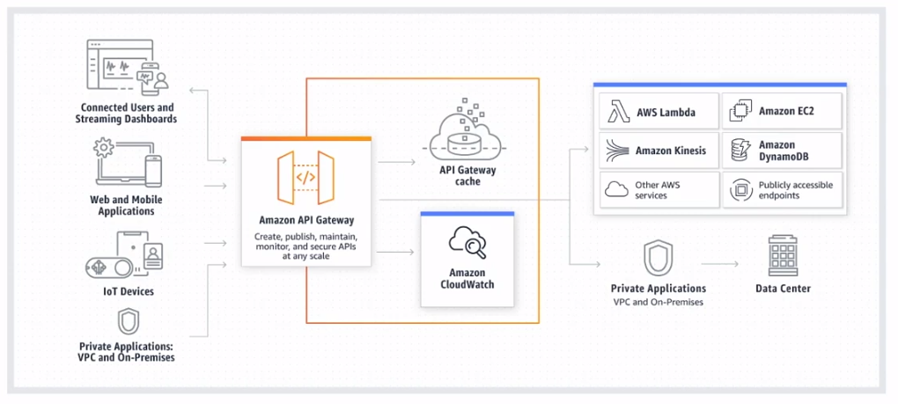
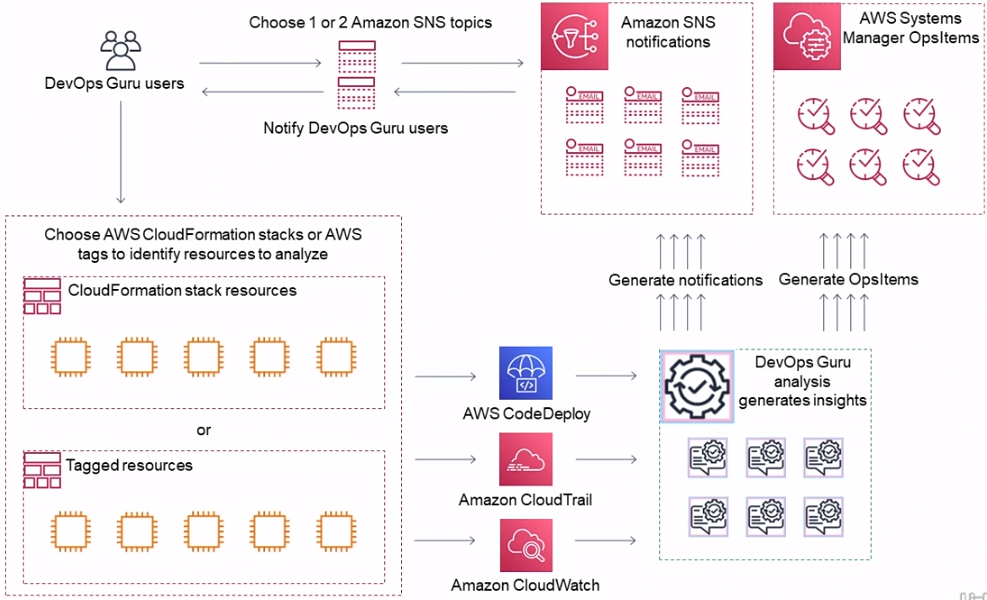

# AWS Essential Training for Developers

[Course](https://www.linkedin.com/learning/aws-essential-training-for-developers-17237791/learn-how-to-create-an-ec2-instance?autoSkip=true&resume=false&u=0)

# Contents
- [AWS Essential Training for Developers](#aws-essential-training-for-developers)
- [Contents](#contents)
- [AWS Essential Setup](#aws-essential-setup)
- [On-Premise to AWS](#on-premise-to-aws)
- [IaaS Compute](#iaas-compute)
  - [Create an EC2 instance](#create-an-ec2-instance)
  - [EC2 instance types](#ec2-instance-types)
  - [Create a key pair](#create-a-key-pair)
  - [Set up a web server](#set-up-a-web-server)
  - [Stopping and starting vs. rebooting instances](#stopping-and-starting-vs-rebooting-instances)
  - [Right-sizing with EC2 autoscaling](#right-sizing-with-ec2-autoscaling)
  - [How to create backups with an AMI Snapshot](#how-to-create-backups-with-an-ami-snapshot)
  - [Saving money in EC2](#saving-money-in-ec2)
- [IaaS Networking](#iaas-networking)
  - [Using security groups as firewalls](#using-security-groups-as-firewalls)
  - [Virtual Private Cloud (VPC)](#virtual-private-cloud-vpc)
  - [Public and private subnets](#public-and-private-subnets)
  - [Internet and NAT gateways](#internet-and-nat-gateways)
  - [Static addresses with Elastic IPs](#static-addresses-with-elastic-ips)
  - [Using VPNs to access private subnets](#using-vpns-to-access-private-subnets)
  - [Scaling with Elastic Load Balancer (ELB)](#scaling-with-elastic-load-balancer-elb)
  - [Learn how to create an Application Load Balancer (ALB)](#learn-how-to-create-an-application-load-balancer-alb)
  - [Point a domain to your EC2s with Route53](#point-a-domain-to-your-ec2s-with-route53)
- [IaaS Storage](#iaas-storage)
  - [Hard drives with Elastic Block Store (EBS)](#hard-drives-with-elastic-block-store-ebs)
  - [NAS with Elastic File System (EFS)](#nas-with-elastic-file-system-efs)
  - [Web storage with Simple Storage Service (S3)](#web-storage-with-simple-storage-service-s3)
  - [Upload a file to S3 from the AWS CLI](#upload-a-file-to-s3-from-the-aws-cli)
  - [Use the SDK to create a file within S3](#use-the-sdk-to-create-a-file-within-s3)
  - [IAM roles for EC2](#iam-roles-for-ec2)
  - [Putting together all of the IAM resources](#putting-together-all-of-the-iam-resources)
  - [Storing passwords with Secrets Manager](#storing-passwords-with-secrets-manager)
  - [Long-term storage with S3 Glacier](#long-term-storage-with-s3-glacier)
  - [Serve content faster with CloudFront](#serve-content-faster-with-cloudfront)
  - [Qs:](#qs)
- [Database as a Service (DBaaS)](#database-as-a-service-dbaas)
  - [What is database as a service (DBaaS)?](#what-is-database-as-a-service-dbaas)
  - [Relational Database Service (RDS)](#relational-database-service-rds)
  - [NoSQL databases](#nosql-databases)
  - [In-memory cashes](#in-memory-cashes)
  - [Big data databased](#big-data-databased)
  - [Buffer data with a message queue](#buffer-data-with-a-message-queue)
  - [Qs](#qs-1)
- [Platform as a Service (PaaS)](#platform-as-a-service-paas)
  - [Hosting web apps with Elastic Beanstalk](#hosting-web-apps-with-elastic-beanstalk)
  - [Running containers on AWS](#running-containers-on-aws)
  - [Using K8s with AWS](#using-k8s-with-aws)
  - [Serverless functions with Lambda (FaaS)](#serverless-functions-with-lambda-faas)
  - [Managing long-running jobs](#managing-long-running-jobs)
  - [Qs](#qs-2)
- [Software as a Service (SaaS)](#software-as-a-service-saas)
  - [User authentication for your app](#user-authentication-for-your-app)
  - [Designing backend API](#designing-backend-api)
  - [Helpful machine learning services](#helpful-machine-learning-services)
  - [Qs](#qs-3)
- [DevOps with AWS](#devops-with-aws)
  - [What is DevOps?](#what-is-devops)
  - [Developer tools within AWS](#developer-tools-within-aws)
  - [Infrastructure as Code with AWS](#infrastructure-as-code-with-aws)
  - [Monitoring with CloudWatch](#monitoring-with-cloudwatch)
  - [DevOps using machine learning](#devops-using-machine-learning)
  - [Qs](#qs-4)
- [Security on AWS](#security-on-aws)
  - [AWS Shield and firewalls with WAF](#aws-shield-and-firewalls-with-waf)
  - [Spot issues with Inspector, GuardDuty, and Macie](#spot-issues-with-inspector-guardduty-and-macie)
  - [Manage EC2 with Systems Manager](#manage-ec2-with-systems-manager)
  - [Traceability with CloudTrail and Security Hub](#traceability-with-cloudtrail-and-security-hub)
  - [Investigate threats with AWS Detective](#investigate-threats-with-aws-detective)
  - [Qs](#qs-5)
- [Extra](#extra)
  - [AWS Well-Architected Framework](#aws-well-architected-framework)
    - [Pillars and design principles](#pillars-and-design-principles)
  - [Getting help from AWS Support](#getting-help-from-aws-support)
  - [Qs](#qs-6)

# AWS Essential Setup
- Set MFA on root account, via Security Credentials.
- Create an IAM user, under a group with given permissions.
- Create an IAM user access key:

# On-Premise to AWS
# IaaS Compute
**EC2 (Elastic Compute Cloud)**
## Create an EC2 instance
- Search 'EC2' in search bar.
- Click 'Launch instance', provide a name for the instance, and select the Application and OS Image.
  - VMs are called AMI (Amazon Machine Images).
  - Many AMI templates have entire server applications installed and pre-configured, e.g. WordPress.
  - AMI marketplace allows vendors to post server images that can be launched **with and without** additional charges.

## EC2 instance types
See here for more for on [instance types](https://aws.amazon.com/ec2/instance-types/).
- Under 'Instance type', see 'Compare instance types' option. 
- Instance prefixes (e.g. t, m, c etc) demarcate the instance family, and are optimised for certain workloads.
- T instance family use burstable-cpu threshold. 
- Instances come in different sizes, offering differing amount of resources, such as, memory, VCPUs, networking speed.
- Estimates can be created before picking the type, using the [AWS Pricing Calculator](https://calculator.aws/#/).

## Create a key pair
- For a Linux instance, must use a key pair to allow SSH access to the server.
- In launch wizard, select 'Create new key pair', will generate a `.pem` file that must be kept safe.
  - Move to `./ssh`, and run `chmod 400 <name>.pem` to ensure the key is not publicly viewable.
  - This can be used to create an SSH session from your local machine.
  - e.g. `ssh -i '<name>.pem' ubuntu@<public dns>.amazonaws.com`
- The matching public key is kept by Amazon, and installed onto our linux instance.
- For a Windows server EC2 instance, the key is used to decrypt the admin password to connect to the instance.
- Under 'Network settings', make sure 'Create security group' is checked, and allow SSH track from 'Anywhere'.
  - This will allow a terminal to connect using private key pairing.
  - There are ways to further protect the server, discussed later.
- Check 'Allow HTTP traffic from the internet' since the EC2 instance will be a public available webserver.
  - HTTPS is unchecked for this course, bc we won't be installing a SSL key onto the webserver.
- Select 'Launch instance' below.
- Key pairs can be deleted under 'Network & Security', 'Key Pairs' on the left hand side.
## Set up a web server
- Select 'Instances' under 'Instances' on the left, you should be the provisioned instance running.
- Select the check box next to the instances name, and click 'Connect'.
- Click 'Connect' under the 'EC2 Instance Connect' tab.
  - This launches a tab with an SSH session running.
- Run `sudo apt update` and `sudo apt upgrade` before going further, as images provided might not include the latest packages or OS updates.
- If kernel updates are required, follow the modals to confirm the update, and restart the VM in the EC2 console.
  - Select the check box next to the instance name, and from the 'Instance state' drop down menu, select 'Reboot instance'.
- In the AWS Shared Responsibility Model, it's our responsibility to connect to servers periodically to run updates.
  - There is automation and orchestration tools to manage this.
- Run `sudo apt install apache2`.
- In 'Instance', under 'Details', will be the Public IPv4 address. Copy this, and paste into a new browser tab to access the server.

## Stopping and starting vs. rebooting instances
- If you stop an instance, you won't be charged for the compute time, but will be charged for the HD and snapshotting.
  - See [here](https://docs.aws.amazon.com/AWSEC2/latest/UserGuide/ec2-instance-lifecycle.html), for a brief description of each instance state and whether it is billed.
- Start/Stopping and instance will move it to another physical server in the availability zone.
- Rebooting will bring the instance back up faster, as it stays on the same server as before.

## Right-sizing with EC2 autoscaling
- An auto-scaling policy can tell AWS that when an event occurs to scale up servers, then shrink back when things return to normal.
  - e.g. CPU usage percent above 80% for 5 mins.
- Vertical scaling is increasing the physical hardware to a single server. Horizontal scaling spreads traffic across several identical servers.
- Scaling methods:
  - Horizontal scaling: creating more instances to handle workload.
    - Has to be baked into application design, see [AWS: High Availability](https://www.linkedin.com/learning/aws-high-availability/).
  - Vertical scaling: increasing the resource allocation to increase throughput of a single server.
- In AWS, the vertical approach would be downing the instance (causing downtime), and changing the instance for a larger/faster server with more resources.
- See, [AWS: Automation and Optimization](https://www.linkedin.com/learning/aws-automation-and-optimization/). 

## How to create backups with an AMI Snapshot
Take a snapshot in time of your server in it's full config.
New instances can be launched to handle a spike in traffic, or restore if there's an issue.

- Under 'Details', 'Networking', note current Availability zone.
- Under 'Details', 'Security', note the name of the Security group.
- Under 'Actions', 'Image and templates', 'Create image'.
- Name the new image, and note the 'No reboot' option.
  - AWS will need to stop the instance to capture an image of it.
  - Enabling No reboot could lead to unintended consequences, as the HD will still be in use.
- Under 'Images', 'AMIs', you will see the image.
- When Status: Available, click 'Launch instance from AMI' button.
  - Back on the [Launch page](#create-an-ec2-instance).
  - Select the same instance type and key pair.
  - Under 'Network settings', select a Subnet that is **different** from the previous Availability zone.
  - Under 'Firewall (security groups)', select the existing security group.

## Saving money in EC2
The instances we've spun up so far are *on demand* instances.
If you can tell AWS upfront want your requirements will be, they'll discount usage.
- This is done via buying a coupon for a 'Reserved Instance' on the left-hand menu.
  - There is a market place to buying partially reserved instances.
- For recommendations based on usage, search 'AWS Cost Management' and 'Recommendations' under 'Reservations'.
- For flexibility, use 'EC2 Savings Plan' instead.
  - Will allow for changes in server size (but not family) over the course of the contract.
- 'Compute Savings Plan' allows for changes to family also.

# IaaS Networking
## Using security groups as firewalls
All traffic is blocked by default and a security group rule allows external traffic.
- A security group with no rules by default means all traffic is being blocked.
- The rules allow specific traffic to pass through.

Instances can use multiple SGs, and their rules become stacked together.

- Launch wizard is the default name given to a SG when the instance is created with the wizard.
  - Once a security group is created, its name cannot be edited.
- However, it can be copied and the copy can be modified.
  - Under 'Network & Security', 'Security Groups', select SG and choose 'Copy to new security group' from 'Actions'.

- To apply an SG to an instance, select the instance and find 'Security' -> 'Change security group', under 'Actions'.
  - Search for your SG in he search bar, apply, and save.

Not a good idea to publicly expose SSH port to open internet over `0.0.0.0/0:80`.
## Virtual Private Cloud (VPC)
Indicated on diagrams with a green box around the VCP.
Every VCP will have a range of non-routable (private IPs) that you can pick from to use in the private network.
When linking computers with a switch, a LAN will work with ranges of non-routable IPs, which can be used by any local network, e.g. 192.168.1.1/255 address ranges used by most home routers.

Search VPC in services search bar at the top of the page.
On left-hand side, select 'Your VPCs'.
There should be one VCP that was created as a default when it launched the first instance.
- It shouldn't be deleted.
- More VPCs can be created to separate projects or businesses.
Select a VPC, under 'CIDRs' you can see that the VPC operates under the range of non-routable IPs of `172.31.0.0/16`.
- 172.31.0.0 - 172.31.255.255 (65,534 usable IPs).

## Public and private subnets
A subnet is a group of sequential IPs within a network space.
- A way to divide the network of available IP ranges, to write networking rules that apply to a group of addresses.

On left-hand side, select 'Subnets'.
- Some subnets will have been created within the default VPC, under each availability zone in the region.
  - The subnets are grouped with IP ranges in different regions.

Best practice:
1. create a public subnet in an AZ, that includes all servers exposed to incoming internet traffic, e.g. web servers.
2. create a private subnet with protections, such as, database or file servers.

Local zones can be enabled in a new subnet to get closer to end users.

## Internet and NAT gateways
A NAT gateway will not allow public originating internet traffic to pass to a server, but an Internet gateway will allow it.

Allows servers in public subnet to reach open internet, and allows outside traffic to pass into server, which is filtered by SGs on that instance.
On left-hand side, select 'Internet gateways'.
- One should of been created for us when we created a new instance.

On left-hand side, select 'NAT gateways', and `Create NAT gateway`.
- If you had a private subnet, you could select it from the 'Subnet' drop-down.
- And then, select an Elastic IP in the second drop-down.

In our home router example, the Elastic IP is what the NAT gateway is going to use on its WAN port
- Any servers using the NAT gateway will appear to the outside world as only having a single IP address.

## Static addresses with Elastic IPs
You can lose the public IP address associated with your EC2 instance if you stop and start the instance.

Managed from the VPC console.
Request an Elastic IP to bind to a NAT gateway (from here or the EC2 console), then bind them to EC2 servers.
- This will replace the public IP address that AWS has randomly assigned to each running public instance
- Not it's a fixed IP that won't change when the instance is stopped/started.

Head to EC2 console.
On left-hand menu, under 'Network & Security', select 'Elastic IPs', and 'Allocate Elastic IP address'.
- Click Allocate at the bottom to create the IP.

**Elastic IPs are billable, unless it's bound to something, like a NAT gateway or EC2 instance.**
Periodically review and release any Elastic IP that isn't in use (Actions -> Release).

Scroll over in the Elastic IP addresses table, see 'Associated instance ID' or 'Association ID'.
- i.e. it's not bound to anything yet.
- Actions -> Associate Elastic IP Address -> search for EC2 instance -> search for only Private IP for instance, confirm.
- In EC2 instances console, details/Public IP address will have updated to the Elastic IP. 

## Using VPNs to access private subnets
Several [examples](https://docs.aws.amazon.com/vpc/latest/userguide/vpc-example-dev-test.html) in [documentation](https://docs.aws.amazon.com/vpc/latest/userguide/configure-subnets.html).

First scenario, similar to what we have already, a VPC with a single public subnet.

If split up subnets into public and private, requires a NAT gateway in the public subnet to allow servers within private subnet to reach open internet.
- This still protects the serves from incoming traffic.

*Questions:*
If the servers in the private subnet are protected from all outside internet traffic, how do you connect to them to administer them?
What if you want to restrict admin access to the servers in the public subnet, e.g. closing off the ports for SSH for linux terminal access, or remote desktop protocol (RDP) for Windows servers?

One way to securely connect to your instances is by using a **bastion host**.
- An instance put in public subnet that is locked down and monitored.
- Connect to this machine first, then from there make connections to other servers in the VPC.

AWS has a [quick start script](https://aws.amazon.com/quickstart/) for this.
- [Linux Bastion Hosts on AWS](https://aws.amazon.com/solutions/implementations/linux-bastion/)
- Can be launched directly into account using an automation language for infrastructure called **CloudFormation**.

Another method for connecting securely to Linux and Windows instances, is to use **AWS Sessions Manager**.
- Available from the **System Manager** dashboard.
- Select Session Manager from under Node Management.
  - With Session Manager an agent runs on the server and after the IAM rules and permissions have been set up, you can connect to instances through the AWS console or command line tools.
  - See *'Set up Session Manager'* link.

Another common solution to secure the network is to use a VPN.
- Using an **AWS Client VPN** you can use a VPN client on another machine to establish a secure connection with the VPC.
- This works well for allowing coding and database management tools to work seamlessly.

Another way to use a VPN within AWS, is a **Site-to-Site VPN**
- Can bridge existing on-prem data center or office network with a VPC.
- Can be used to securely move data to AWS as a part of a *cloud migration*.
- Can be used in a hybrid model where some on-prem infrastructure continues to serve the application, but start using AWS services to support them.

If you create multiple VPCs, and they need to be joined together along with the VPN connections to on-prem networks, see **AWS Transit Gateway**.
- Helps manage bridging all these networks together.

If you need a fast and stable connection between data center and AWS, consider AWS Direct Connect.
- Provides a physical connection been both, used in large scale hybrid deployments.

## Scaling with Elastic Load Balancer (ELB)

There are three types of ELBs:
1. Network LBs are fast, but are without many features to offset the cost of not looking closely at the incoming traffic.
2. Gateway LBs are for switching traffic coming in to virtual networking appliances, made from the vendors which are not AWS (e.g. Cisco Virtual Firewalls).
3. Application LBs are great for web traffic, bc they will consider traffic and route it based on set of rules.
- This is what we will use, as we're using web servers.

An ALB is used for HTTP traffic, and an NLB is used for traffic that requires speed, like low-latency streaming services using TCP and UDP.
## Learn how to create an Application Load Balancer (ALB)

Before we attempt to make the ALB, note:
1. Which two availability zones the instances are running in.
2. Which security group are instances using.

- In left-hand submenu, find 'Load Balancers', select 'Create Load Balancer', and under ALB, press 'Create'.
- Give a name (`testalb`), under 'Network Mapping: VPC' -> select the default VPC, under 'Network Mapping: Mappings' -> select two AZs the EC2 instances are in.
  - If you had public and private subnets, you would select the public subnet under the AZ.
- LBs use SGs just like EC2s do, we'll create a new one:
  - Under SGs, create new SG. 
  - Give name: `alb-sg`. Give desc: `http for webservers`. 
  - Add inbound rule, HTTP: Source: Anywhere IPv4.
  - Add outbound rule, HTTP: Specify target server, set Dest: Custom, and search for SGs, select SG bound to each running EC2 instance.
    - Don't spec IP ranges, but SGs. Any instance bound with SG, will be able to receive traffic from the ALB.
  - Remove 'all traffic' option if there.
  - Create SG, and close out of the new SG tab.

- Refresh ALB with button next to drop down, and select the new SG created in steps above, remove the default.
- LBs route traffic to target groups, which include the target servers.
  - Forward to: *Select target group* or *Create target group* to open settings in new tab.
- Under 'Listeners and routing' section, 'Create target group':
  - Select instances for target type, give Target group name: `webservers`, port will be forwarding 80, HTTP1 traffic.
  - Select default VPC
  - Health checks will be run to determine if the server is healthy before sending traffic to it
    - It will check a defined port on the instances in the target group for a defined status code.
  - Click Next, the target servers will now register to target group we just created, by checking the boxes and click 'Include as pending' button.
  - Create target group.
- Close out of the new tab, and hit refresh ALB with button, and select the new TG created in steps above.
- Click Create LB and view.

Confirm that the servers are healthy:
Select the new LB, in details panel click on 'Listeners and rules' tab.
- Under 'Default action', click on `webservers` TG, notice two servers under 'Targets' tab.
- Health status will eventually turn healthy.

Back in 'Load Balancers', under description, copy 'DNS name' assigned to load balancer, and paste into browser.
- Now LB is shuffling traffic on port 80 to both healthy servers.

## Point a domain to your EC2s with Route53

- Search and select Route 53 in services search bar.
  - If you don't have a domain name, one can be purchased from Route53
To buy one from AWS:
- In the left-hand menu, under 'Domains', select 'Registered domains'.
  - Click Register domain button, and follow the prompts in the wizard
If bought from a different registrar:
- You only need to point your domain's DNS servers to the Route53 servers.
- Look at [registrar documentation](https://docs.aws.amazon.com/Route53/latest/DeveloperGuide/migrate-dns-domain-in-use.html) to register DNS servers for the domain.
- [Index of supported top-level domains](https://docs.aws.amazon.com/Route53/latest/DeveloperGuide/registrar-tld-list.html)
If you have a domain:
- In the left-hand menu, under 'Domains', select 'Hosted zone'.
  - Type in domain name, and make sure 'Public hosted zone' is selected, and click create.
  - Get Name servers information from the details page of the HG.
- Head to your domain registrar, find DNS settings, and add Nameservers.
  - This can take a while to complete
- Back in Route53, under Records tab, you will see all DNS records for domain name.
- Point the root of domain to the ALB:
  - Leave the subdomain blank to create the route record.
  - Select 'Alias', 'Route traffic to: Alias to Application and Classic Load Balancer', 'Region: your region', 'LB: your LB', click 'Create records'.
- Alias to `www` subdomain:
  - Type `www` in 'Record name'.
  - Select 'Alias', 'Route traffic to: Alias to another record in this hosted zone', 'Record: the root record made above', click 'Create records'.

# IaaS Storage

## Hard drives with Elastic Block Store (EBS)
Primary storage for EC2 is Elastic Black Store (EBS). When an AIM is made, it creates an EBS snapshot of the servers main drive.

The AIM includes everything needed to relaunch the instance, the EBS volume is just a snapshot of the HD.
For backups of the server, take an AIM image periodically, as it can be relaunched to start the server at a point in time, e.g. this would be good for a DB server.

'Volumes' are the HDs attached to the instance, they can be created an attached (and detached) to your instances via the 'Volumes' console.
Volumes are complete blank once attached, they need to be formatted. Docs are available to do this via the info icon at the top right.
Volumes can be modified to increase or decrease the size; new space needs to be formatted.

EBS volumes are fast, so are the default for EC2 instances, but alternatives are available for shared drives between instances.

## NAS with Elastic File System (EFS)
One limitation of EBS, is that it's attached to an EC2 volume, therefore it can't be written to from two instances.

A NAS (network attached storage) creates a file share on the network.
Amazon's version of a NAS is the Elastic File System (EFS), so the same drive can be mounted on several EC2 instances to share common data between applications.

EFS isn't as fast as EBS, as EBS sits closer to the raw HW of the instance. 
Therefore the EBS must contain:
- the operating system for instance
- the application source code.
The EFS can contain:
- anything that the instances need to share.
- like user uploaded data.

HOW TO:
- In AWS console, find EFS in search bar, and select 'Create file system'.
- Give a name, and click 'Create'
- Select volume created, and click 'Attach', follow wizard to attach drive the instance.

TIP:
Use FSX when running Windows server instances, this will allow a mounted drive between both instances, like a commercial NAS.

## Web storage with Simple Storage Service (S3)
S3 buckets allow you to store anything and share with users without config servers and file shares.
S3 slower, but unlike EFS, you don't need a server to host files.

HOW TO:
- In AWS console, find S3 in search bar, and select 'Create bucket'.
- Give name + random numbers, select region that other resources are in, and click 'Create bucket'.
- Select bucket in the console and create folders.
- Select folder, and upload stuff into it.
- Select the uploaded file, and see the Object URL link.
  - If you try and access it will error, bc the buckets are private by default.

## Upload a file to S3 from the AWS CLI
You can use CLI to up/download files to/from S3 bucket.
HOW TO:
- Install CLI to system
- `aws configure`, will ask for credentials, set region as that where the bucket is, otherwise leave defaults
- Test with `aws s3api list-buckets` or `aws s3 ls`, should list accessible buckets in CMD or JSON.
- `s3` gives higher level, `s3api` commands are closer to the api calls in source code.
- Copy stuff in with `aws s3 cp <somefile> s3://<bucketname>/<foldername>/`
- See that the file is updated in console view.

Has sync command to auto backup S3.

## Use the SDK to create a file within S3
Software development kit
**<!> don't do this bc it posts keys into source code <!>**
HOW TO:
- Note bucket name
- In console, search EC2, find an instance, and log into instance as Ubuntu user from the console.
- See exercise files `05_05` for commands to install php (`phps3commands.txt`).
- Make sure region, credentials, and buckets are changed **<!> here <!>**
- Copy code from ?php and copy into nano, save `ctrl + o`, `enter`.
- `ctrl + x` to exit nano.
- Run `php s3test.php`.
- Return to the browser, and search for S3.
- Click on bucket name to browse bucket from route, you'll see a file there.
- Open it, and you'll see it matches what we inserted.

Python and Node SDKs available.

## IAM roles for EC2

IAM Roles allow us to create permissions for EC2 instances.
- e.g. create a role to read/write to S3 buckets, and apply to EC2 instances.

The role is like a property of an instance, therefore there is no keys or access rights to be stolen.

HOW TO:
- Find IAM console.
- Select 'Roles', select 'Create role'.
- Select 'AWS service' as trusted entity, select 'EC2' as the use case, 'Next'.
- Add permissions, find S3, and check the record named `AmazonS3FullAccess`, 'Next'.
- Give name, e.g. `s3grantforec2`, 'Create role'.
- Switch back to EC2 console, check instances, and find an instance.
- In Actions, under 'Security', select 'Modify IAM Role'.
- Select `s3grantforec2` from drop down, and update.
- Get back on a session to the EC2 instance, and update `php s3test.php` to remove credentials.
- Run the file `php s3test.php`, to confirm it still works.
The EC2 instance is using the role now to auth against S3.

Can also create custom policy that would apply to a single bucket, etc.
- Out of scope here.

## Putting together all of the IAM resources
AIM is always controlled by AWS global region, settings/services which aren't tied to a region.
The root account sits off to the side, not an AIM resource, but we can create groups, users, and roles as IAM identities/entities.

## Storing passwords with Secrets Manager
Can create AIM role for EC2 instances to access S3 removing access key from code.
However, will need to use non-AWS 3rd party services which will need auth.
Look at Secrets Manager to store key/passwords securely, then call aws api to retrieve the auth in code.

## Long-term storage with S3 Glacier
Old data which wan't to keep, create lifecycle policy to automatically move old files from S3 bucket to cheaper storage class (Glacier).
- Good for server back-ups or log files required for auditing.

Only put data that's infrequently used, as there is a delay to access.

HOW TO:
- Find S3, select bucket, select folder, and a file.
- Under storage class, edit, and change to Glacier (there is others, e.g. One Zone-IA is the cheapest bc it isn't replicated against all availability zones).
- Management tab from bucket name, create lifecycle policy.
- Properties tab shows versioning, and static website hostin (like basic github pages).

AWS Snow moves lots of data via a hard drive array that's plugged in on your end, shipped to them, and uploaded to AWS.

## Serve content faster with CloudFront
Can push contents of S3 bucket to edge servers worldwide.
CloudFront is a Content Delivery Network (CDN) that mirrors a S3 bucket.

HOW TO:
- In S3, bucket settings, find Permissions.
- Allows control Public access to bucket, but do observe the warnings.
  - See more on policies
- Edit block public access, and uncheck the box, save.
- Under Object Ownership, edit, and ACLs enabled, save.
- Under Objects, find test folder, and find a file.
- Change Permissions by editing, and allow read checkbox for everyone, save.
- Click object url, and will be available publicly.

HOW TO:
- Find CloudFront
- Create a CloudFront Dist
- Find origin domain that has S3 bucket created.
- Bottom of page, create.
- When Dist complete, copy Distribution domain name, and paste in browser (adding `folder/file path`) to see the file.
AWS Global Accelerator to speed up data transfer, can be turned on from S3 console.

## Qs:
1. What is the most cost effective way to move petabytes of backups that you need to keep for long-term retention into AWS?
    - Snowball
2. What is a valid use case for a public S3 bucket?
    - Serving web content with CloudFront
3. How can you restrict access to your bucket?
    - Create a custom bucket policy.
4. Which S3 storage class is best for storing the only copy of your latest backups for your databases?
    - S3 Standard
5. What is the difference between an IAM Identity and an IAM Entity?
    - Entities are the users and roles requesting access, whereas identities include anything you can attach a policy to which includes groups.
6. Should you put secret access keys into secrets manager?
    - No, use an IAM role instead.
7. What is the best use case for using the AWS SDK?
    - Accessing AWS resources from within your application source code
8. Why is using a IAM role better security than using access keys?
    - IAM roles grant permissions without leaving a key on the server that can be compromised.
9.  What CLI command will list all of the S3 buckets you have access to?
    - aws s3 ls
10. What is a limitation of EFS?
    - EFS is only supported for Linux instances
11. Order the speeds of the AWS storage services by fastest (first in the list) to slowest (last in the list)
    - EBS, EFS, S3
12. What is the difference between a Amazon Machine Image (AMI) and an EBS snapshot?
    - AMI's include everything needed to relaunch the instance, whereas an EBS snapshot is only a backup of the data volume.
13. Your users upload large video files through your app into an S3 bucket. How can you increase the upload speed?
    - Transfer Accelerator
14. You have your EC2s created within a single region, but now you would like global reach. Without cloning your application into multiple regions, what is way you can provide faster access to your resources?
    - Global Accelerator

# Database as a Service (DBaaS)

## What is database as a service (DBaaS)?
DBaaS: The cloud provider manages the database servers and backups. You read and write your data to the managed service.

If migrating an existing application to AWS, there is a Database Migration Service from on-prep to cloned synced cloud DB.

If building a new application, ask what are the data needs for the applications?
- What data will be stored?
- How much data do we need, how much will be written per hour?
- Write throughput?
- What uptime do we need?

Broad categories:
- Lots of historical data for reporting; Big data solution.
- Real time access to current month of data; Relational database + Big data (stored later)
- If relational DB is going to ingest a large stream of data; Queue (to aggregate data over time) + Relational.
- If storing object based and don't need to generate reports; NoSQL.

Once the above questions are answered:
- Feature sets, budgets and vendor support

## Relational Database Service (RDS)
MySQL or MSSQLServer, EC2 instance can be installed with DB directly onto server; replicates on-prem env.
Resonsible for:
- Config
- OS updates
- DB engine updates
- Monitoring
- Failover replication

AWS has managed platform, where everything else is managed above is by them.
Supports most popular databases, PostgreSQL, MySQL, SQL Server, Oracle.

Similar to launching an EC2, can deploy different sizes, and can size up (but not down).
- i.e. start small and scale up.
If high uptime, use Multi-AZ, although doubles the cost (despite connecting to one endpoint in code).
- Can start in a single AZ, and enable if more uptime is needed.

Back ups won't be resorted onto of an existing cluster, but it will create a new one for safety.
- Will need to change the connections in code.

Amazon Aurora, is similar to mySQL or postgress from a dev standpoint
- more server management handled by AWS
- hands off as possible

## NoSQL databases
NoSQL: storage and retrieval of data that is not stored in a tabular relational format
- Think spreadsheets (relational) vs. JSON (NoSQL).
Great for storing data in a schema-less format.

DynamoDB is the most popular key:value store. DB as a service offering, as no management required.
- Easier that RDS offering to scale up and down.
- Global tables let data be replicated accross regions.

DocumentDB is DB plateform that's similar to MongoDB.

## In-memory cashes
Speeds up data look up for frequently accessed infomation.
ElastiCashe helps manage and deploy two types of in-memory cache, Redis and Memcached.
Otherwise, Redis and Memcashed can be installed and deployed to EC2 servers directly.
This is simplfied in ElastiCashe.

## Big data databased
Redshift is AWS service for this.
Terms:
- data lake: unstructured data, usually stored a raw text data, often large (think webserver logs or sensor data from IoT).
  - If needs to be mined for trends and info, AWS Athena.
- data warehouse: structured data (like relational DB) optimised to return results.
  - AWS Redshift for this; cluster of DB server nodes, collect and store data, maintained by AWS, accessed with SQL.
  - Redshift Spectrum can load in raw files from datalake to run queries.

## Buffer data with a message queue
When new data needs to be written, there may be a hold/lock on the table, preventing others from accessing until write is complete.
This wait time on read can slow down applications.
Queue temp stores data that's needed to write, so applications aren't waiting on DB and can continue using the app, the data is written later.
Can also be used as a messaging serverice.
Kinesis:
- Handles large stream of realtime data or application logs
- Connects to other services for realtime reporting
SQS (Simple Q service):
SNS (Simple notification service):
- Push out a message, email text or http call to a webhook.

Not how should we choose between these three, more, **when** should we use Kinesis, SQS, and SNS.
## Qs
1. What is the best use case for using the Database Migration Service?
    - You are migrating an on-premise production database to the cloud and both databases need to stay in-sync.
2. You are going to host an application that uses a MySQL database, but you do not want to managing scaling or database administration tasks. What is the best choice for hosting this database?
    - Aurora
3. Which service can send a push notification to a mobile device?
    - SNS
4. What is a valid use case for a queue or message broker that would sit in front of your relational database?
    - When you need to ingest a large stream of data
5. If you need to store large streams of user activity data coming from a web and mobile application and generate aggregated reports on usage patterns, which database is the best choice?
    - Redshift
6. You have 10,000 Internet of Things devices that are sending in real-time telemetry on vehicle movement at 5 second intervals. What is the best service to capture this data?
    - Kinesis
7. What in-memory caching server is NOT supported by ElastiCache?
    - Elasticsearch
8. Your application uses an RDS for MySQL database and is slowing down because of too many reads. What can speed up your database?
    - ElastiCache
9. In the shared responsibility model, who applies patches to your database engine in RDS?
    -  AWS will apply the patches automatically during the next maintenance window, but you may have an option to defer it.
10. Which database is a NoSQL database type that can quickly store and retrieve key value pairs?
    - DynamoDB

# Platform as a Service (PaaS)

## Hosting web apps with Elastic Beanstalk
Good when have single code base for project, and just want AWS code and let them manage servers and OS updates.
It's still EC2 servers, but good for devs who can't/won't manage servers. AWS have tutorials on creating HA WordPress site.

Lightsail similar to WordPress hosts, like GoDaddy, etc.
If you outgrow Lightsail, will transition out into EC2.

## Running containers on AWS
Containers take large monolithic single applications, and break features down into mircoservices, that are easier to:
- Scale, monitor, and maintain.
- e.g. app sign-ups, payments, reports.

Not like EC2 instances, more like it's own computer, with application software, with deps and libraries pre-installed and configured.

Serveral platforms, but most popular Eastic Container Service (ECS).
Container Orch tool, first create a cluster, then create nodes (e.g. EC2s) that will run containers.
Can load balance containers accross nodes in different AZs, providing scaling and redundancy is EC2s fail.

Elastic Container Registry (ECR)
- Place in AWS to keep container images, blueprints needed to spawn copies on containers

Setting up ECS type definitions:

Launch types:
- Fargate - on demand nodes willing to run any number of containers (containers with one task that stops exe when finished).
  - containers don't always need to be running and can offset spin-up time.
- EC2 - containers always running and processing requests and available to respond immediately (e.g. whole webserver backend, node.js).
- External - allows containers to run on-prem in hybrid cloud env.

## Using K8s with AWS
K8s most popular container orch SW, open source google borg, AWS has Elastic K8 Service (EKS)

| ECS | EKS |
| -------- | ------- |
| Simple | Harder, but K8s run anywhere, so not lock in |
| Less popular | More popular, support, and integration     |
| Basic networking | Advanced control of networking layer   |

TIP:
- Start small and scale up
- ECS and Fargate to get started quickly
- Migrate workloads that are always-on to ECS instances
- Scale up to K8s with EKS
- When on-prem, host your own on-prem instead of paying EC2, with EKS

## Serverless functions with Lambda (FaaS)
A small chunk of code that runs on your cloud platform every time an event occurs (e.g. a incoming web request).
Think "easier containers", give us the code, and we'll figure out the rest.

To build an entire app this way is called **Serverless Architecture**.
- An application that responds to incoming events without the need for always-on servers that you manage.
- Taking source code and building and running a container for you, on a EC2, on a physical server in a AZ.

HOW TO:
- Search Lambda
- Can test in browser, keep it small and simple.
- Break apps into functions and orch them.
- Can build/expand an entire web app using lambda.

## Managing long-running jobs
Batch processing and work flows, AWS has 'Batch'.

Manage and schedue jobs that use EC2 Spot Instances, amazons unused capacity, via a bidding system.

Multi-step workflow, look at 'Step Functions', easier to read than cron jobs.

## Qs
1. Which AWS service can host the web application server for a Wordpress site?
    - Elastic Beanstalk
2. In the shared responsibility model, who would apply the Wordpress updates to your site running in Elastic Beanstalk?
    - You apply the Wordpress updates.
3. What is usually the best service for implementing a multi-step workflow within AWS?
    - Step Functions
4. What is the difference between ECS and EKS?
    - EKS runs your containers using Kubernetes and gives you more control over the networking.
5. Which service can host a Docker container?
    - All of these services can be used as a Docker host (Elastic Beanstalk, EC2, ECS).
6. Lambda does not implement which cloud design principle?
    - Infrastructure as code

# Software as a Service (SaaS)
## User authentication for your app
SW and app integrations that run in the cloud that you don't have to write or maintain (e.g. Google Docs)

Services that can be baked into the application, and "just work". Most of the responsibility in on AWS and not you.
You use the service, and they bill you for usage, e.g. logins.

Services to help manage user auth, Cognito, sign-in integrations with other users (Facebook and Google, etc.)

HOW TO:
- Find Cognito
- Select 'Create user pool'
- Choose between managing logins on Cognito (making new accounts), or also enable other identity providers.
- Select sign-in options
- Define sign-in rules
- Define account recovery
- Configure sign-up experience and message delivery
- Under SMS select 'Create a new IAM role', and give name '<x>role'
- Give the user pool a name + random numbers
- Sign-in pages can be hosted on AWS.
- When created, select the user pool, and see App integration. 

**Amazon has Simple Email Service (SES)
**

## Designing backend API
If designing a microservices arch for backend of web or mobile app, you are likely building out an API to allow frondend to interface with backend code.
Take a look at API gateway to publish REST API endpoints for each microservices, and point them at other AWS stuff.

If GraphQL API, look at AppSync to wire together multiple AWS services. Logging and auth made easier. Brokers traffic to other AWS services.

Errors and slow downs are show via AWS X-ray, scanning cloud infrastructure, e.g. slow endpoint.

## Helpful machine learning services
AWS has tools that can be build into apps to do all sorts:
- Image classification
- Text reading
- Voice inputs
- Translation

Use SageMaker to build and train ML models without managing servers.

Otherwise, easy to use APIs that can be baked into apps 
- Comprehend: sentiment Analysis.
- Lex: build chatbot
- Personalize: promote recommended products based on shopping habits.
- Polly: narrates text
- Rekognition: extract face, or documents
- Textract
- Translate
- Transcribe: transcribe natural speech to text.

## Qs
1. What service can manage a REST API layer?
    - API Gateway
2. Your new mobile application uses GraphQL to interface with it's backend servers for storing data. What service can help you manage a GraphQL endpoint?
    - AppSync
3. What service can handle user authentication for your web and mobile applications?
    - Cognito
4. What is NOT a benefit of Software as a Service (SaaS)?
    - The software is always free.
5. Your application sometimes runs slowly and is built using microservices with API Gateway and ECS with EC2 instances and an RDS database. What service can trace requests through the app and help you find the problem?
    - X-Ray
6. What service will identify the things it finds in an image?
    - Rekognition

# DevOps with AWS
## What is DevOps?
Removes barrier between teams, development and operations.
- The developers help maintain servers
- IT people work more on the code
They have shared goals, releasing new features and ensuring site reliability.

Look at infrastructure as we look at code, throw-away objects derrived by defined classes.

## Developer tools within AWS
Every new change, check in changes, rebuild app, package it back up, and deploy to platform.
- Now, everytime code is checked in, everything is automatically tested and deployed to a staging environment, then if ok, deployed into production.

Agile: release early and often.
- Find bugs faster

Dev ops practices:
**1 .Continuous Intergration (CI)**
Smaller changes to the code are automatically tested whenever a change is made by any developer.

CodePipeline:
- Used to create a workflow that automatically pulls code
- Builds the project
- Runs automated test using AWS CodeBuild.

At end of pipeline..
**2. Continuous Deployment (CD)**
Tested changes are automatically deployed to a staging environment and can then be automatically sent into produciton.
- Quickly introduce changes into production system.
- AWS CodeDeploy.

## Infrastructure as Code with AWS
Everything in the cloud is virtual.
Deployment automation tools can check all servers against the source of truth, and set config back to original states.
See AWS OpsWorks
Infrastructure management tools:
- Puppet
- Chef
- Ansible
- AWS CloudFormation: allows script of EC2, VPC, LBs, etc.
  - Start early on, and build up over time.

HOW TO TEMPLATE:
- Find CloudFormation
- Create stack
- Create new resources, or a script that describe existing.
- View in Designer to see the template.
- Will even install server packages for us.

Terraform:
- Allows AWS or other cloud as providers
- Large community
- Will ask for access key, so will use API to create and manage resources for you.
- Can move between cloud providers

## Monitoring with CloudWatch
CI/CD expands the role of monitoring the service, how is the site performing.
See AWS Health, to check for outages or performance issues with AWS services.

HOW TO:
- Find CloudWatch.
- Metics, all metrics.
- EC2 card, Per-instance metrics.

See Logs and Alarms
It doesn't offer APM, application performance monitoring.
Third party AWS parteners:
- Newrelic
- Dynatrace
- Datadog
Hook into AWS account and source code.

## DevOps using machine learning
AWS DevOps Guru uses ML to look at operational data accross AWS resources, and notify is things are out of place.

CodeGuru will look at repo, and do an automated code review on source code, posting comments.

## Qs
1. What machine learning service can inspect your source code for vulnerabilities?
    - CodeGuru
2. What is something that is difficult to monitor with CloudWatch?
    - Internal application performance and response times
3. Which service leverages machine learning to spot anomalies in how your services are performing?
    - DevOpsGuru
4. Which AWS tool is best at defining AWS services as code?
    - CloudFormation
5. What is NOT a design principle for DevOps teams?
    - Tightly coupled components
6. What's the difference between continuous integration (CI) and continuous deployment (CD)?
    - CI automatically builds your code and runs tests against it, while CD will automatically deploy working code.

# Security on AWS
## AWS Shield and firewalls with WAF
Lots of security features, and guides on best practices for security.
Two services that help with filtering and blocking traffic.

Web Application Firewall (WAF):
- Connect to load balancer, and used as any other firewall product.
- Has managed rules that you can subscribe to, which are being updated to prevent against the latest threats. 
Sheild
- Help mitigate a DOS attack (our responsibility).

## Spot issues with Inspector, GuardDuty, and Macie
Run these services on a regular schedule
GuardDuty:
- Finds suspicious network connections server is making to indicate if it's been compromised
- May be overwhelming
Inspector:
- Full scan of cloud infra, looks for unpatched servers and common security vulnerabilites.
- Start here if you inherit someone elses account.
Macie:
- Scan cloud resources and look for sensitive data and report back if it's being shared publicly.

## Manage EC2 with Systems Manager
Connect to all EC2s to run commands applicable to all EC2s.
Node Management: reports issues.
Session Manager: secure way to access EC2 instances.
Run Command: another way instead of terraform.
OpsCenter: central console to tie alerts together.

## Traceability with CloudTrail and Security Hub
- Audit trail of changes made to AWS account.
- Can log requests made through the API

Security Hub:
- Single readout of things to look into from various security products.

## Investigate threats with AWS Detective
- Log and scan all VPC logs and cloud trail data to bring up users and resouces that look sus.

## Qs
1. What service will give you a variety of tools for managing security patches and tracing incidents for your fleet of EC2 instances?
    - Systems Manager
2. Web Application Firewall (WAF) deploys on top of what other AWS service?
    - Application Load Balancer (ALB)
3. What is the difference between AWS Detective and AWS Inspector?
    - Detective lets you investigate into the root causes of a security event, Inspector will scan your servers for vulnerabilities.
4. To comply with some of the auditing requirements of some compliance standards, what AWS tool can be enabled to maintain an audit log of access and changes to your AWS infrastructure?
    - CloudTrail
5. An ECS service that handles your payments microservice was updated to use an incorrect task definition and is now pointing at the wrong container image. How can you determine who made this change?
    - CloudTrail
6. What is one difference between GuardDuty and Inspector?
    - GuardDuty can actively scan your entire AWS account for suspicious traffic to detect a breach, whereas the Inspector agent can periodically scan your EC2 instances to check for vulnerabilities to prevent a breach.
7. You recently backed up some data files to S3 from a third-party software vendor that your customer service team uses. What tool can you use to make sure these backups aren't storing sensitive user data?
    - Macie
8. An EC2 instance running a Wordpress site keeps getting hacked, even though you have patched Wordpress and scanned and fixed any known vulnerabilities. What AWS service can help you detect the next time the starts sending suspicious internet traffic?
    - GuardDuty
9. What service can scan your EC2 instances for known vulnerabilities?
    - Inspector

# Extra
## AWS Well-Architected Framework
Tool within AWS that will analyse current arch, and let you know if you can fix something to align with these principles.

### Pillars and design principles
1. Operational Execellence
   - Infra as code; CloudFormation
   - Many, small changes
   - Design for failure; putting EC2 instances in different AZ
   - Learn from failure
   - Quickly make changes to operational procedures
2. Reliability
   - Automatically recover from failure to keep uptime and HA
   - Test recovery in safe env
   - Stop guessing capacity and usage, track the metrics and right-size the resources
   - Scale horizontally; using EC2 auto scalling and LBs
   - Implement elasticity
   - Automate change and tracking
3. Security
   - Use ID management policies, and audit who has access
   - Use traceability, like CloudTrail, to know what they're doing
   - Apply security everywhere, at every layer
   - Automate security audits so they happen
   - Secure data at rest or in transit
   - Limit exposure of sensitive data, even internally
   - Practise for security breaches
4. Performance Efficiency
   - Have mechanical sympathy: how are the tools having to work under the hood, what's happening to an EBS volume?
   - Tweak settings for max performace
   - Use managed services bc no-ones an expert, focus on building the product
   - Use serverless arch, like Lamdba
   - Decouple components instead of monoliths (and design for failure!)
   - Think parallel
   - Run experiments, be agile
   - Go global in minutes, start small, but think ahead
5. Cost Optimization
   - Save on IT capital and use AWS econ of scale, hire a team that focuses on business value
   - Have a budget, practise good financial management
   - Pay-as-you-go consumption
   - Measure usage for right sizing, if you're needs are fixed or elastic?
   - Tag expenditures across teams, dept, project
6. Sustainability
   - Maximise application efficiency, reducing elec and waste
   - Use managed services, reduce waste in application, elastic, right-sizing
   - Know your environmental impact

## Getting help from AWS Support
AWS own resources and teams.
- Read the docs
- AWS have own training resources and academy
- Join partner network to connect to consultants and partners
- Attend events

Can add support plan with Root user, search Support in AWS.

## Qs
1. Which support plan assigns you a Technical Account Manager?
    - Enterprise Support Plan
2. What is the best support plan for an application that just recently launched and uptime is important, but not critical?
    - Business Support Plan
3. Which AWS resource gives you access to third-party professionals who can assist you in building your application?
    - Amazon Partner Network
4. You recently moved your application into the cloud and enabled EC2 Auto Scaling to add and remove additional servers to the cluster based upon demand. Which principle is this?
    - Implement elasticity in the cloud versus on-premise.
5. You load balanced your application across two availability zones. Which design principle is this?
    - Design for failure
6. If you use SQS in your account creation microservice to signal a worker to process a background check on a new account, which key design principle are you using?
    - Decouple components instead of monoliths.
7. You used Terraform to track and deploy changes to your cloud infrastructure. This falls under which pillar of the Well-Architected Framework?
    - Operational Excellence
8. What is not a value proposition of the cloud?
    - Serverless

