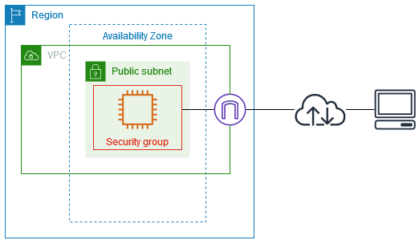
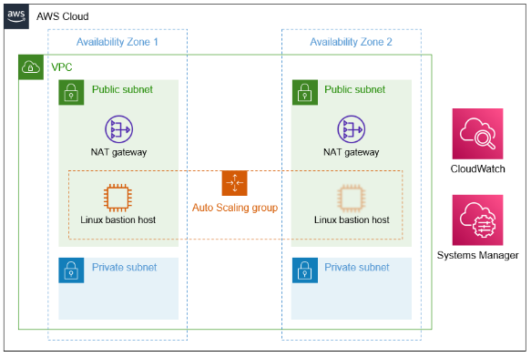

# AWS Essential Training for Developers

[Course](https://www.linkedin.com/learning/aws-essential-training-for-developers-17237791/learn-how-to-create-an-ec2-instance?autoSkip=true&resume=false&u=0)

# Contents
- [AWS Essential Training for Developers](#aws-essential-training-for-developers)
- [Contents](#contents)
- [AWS Essential Setup](#aws-essential-setup)
- [On-Premise to AWS](#on-premise-to-aws)
- [IaaS Compute](#iaas-compute)
  - [Create an EC2 instance](#create-an-ec2-instance)
  - [EC2 instance types](#ec2-instance-types)
  - [Create a key pair](#create-a-key-pair)
  - [Set up a web server](#set-up-a-web-server)
  - [Stopping and starting vs. rebooting instances](#stopping-and-starting-vs-rebooting-instances)
  - [Right-sizing with EC2 autoscaling](#right-sizing-with-ec2-autoscaling)
  - [How to create backups with an AMI Snapshot](#how-to-create-backups-with-an-ami-snapshot)
  - [Saving money in EC2](#saving-money-in-ec2)
- [IaaS Networking](#iaas-networking)
  - [Using security groups as firewalls](#using-security-groups-as-firewalls)
  - [Virtual Private Cloud (VPC)](#virtual-private-cloud-vpc)
  - [Public and private subnets](#public-and-private-subnets)
  - [Internet and NAT gateways](#internet-and-nat-gateways)
  - [Static addresses with Elastic IPs](#static-addresses-with-elastic-ips)
  - [Using VPNs to access private subnets](#using-vpns-to-access-private-subnets)
  - [Scaling with Elastic Load Balancer (ELB)](#scaling-with-elastic-load-balancer-elb)
  - [Learn how to create an Application Load Balancer (ALB)](#learn-how-to-create-an-application-load-balancer-alb)
  - [Point a domain to your EC2s with Route53](#point-a-domain-to-your-ec2s-with-route53)
- [IaaS Storage](#iaas-storage)
  - [Hard drives with Elastic Block Store (EBS)](#hard-drives-with-elastic-block-store-ebs)
- [Database as a Service (DBaaS)](#database-as-a-service-dbaas)
- [Platform as a Service (PaaS)](#platform-as-a-service-paas)
- [Software as a Service (SaaS)](#software-as-a-service-saas)
- [DevOps with AWS](#devops-with-aws)
- [Security on AWS](#security-on-aws)

# AWS Essential Setup
- Set MFA on root account, via Security Credentials.
- Create an IAM user, under a group with given permissions.
# On-Premise to AWS
# IaaS Compute
**EC2 (Elastic Compute Cloud)**
## Create an EC2 instance
- Search 'EC2' in search bar.
- Click 'Launch instance', provide a name for the instance, and select the Application and OS Image.
  - VMs are called AMI (Amazon Machine Images).
  - Many AMI templates have entire server applications installed and pre-configured, e.g. WordPress.
  - AMI marketplace allows vendors to post server images that can be launched **with and without** additional charges.

## EC2 instance types
See here for more for on [instance types](https://aws.amazon.com/ec2/instance-types/).
- Under 'Instance type', see 'Compare instance types' option. 
- Instance prefixes (e.g. t, m, c etc) demarcate the instance family, and are optimised for certain workloads.
- T instance family use burstable-cpu threshold. 
- Instances come in different sizes, offering differing amount of resources, such as, memory, VCPUs, networking speed.
- Estimates can be created before picking the type, using the [AWS Pricing Calculator](https://calculator.aws/#/).

## Create a key pair
- For a Linux instance, must use a key pair to allow SSH access to the server.
- In launch wizard, select 'Create new key pair', will generate a `.pem` file that must be kept safe.
  - Move to `./ssh`, and run `chmod 400 <name>.pem` to ensure the key is not publicly viewable.
  - This can be used to create an SSH session from your local machine.
  - e.g. `ssh -i '<name>.pem' ubuntu@<public dns>.amazonaws.com`
- The matching public key is kept by Amazon, and installed onto our linux instance.
- For a Windows server EC2 instance, the key is used to decrypt the admin password to connect to the instance.
- Under 'Network settings', make sure 'Create security group' is checked, and allow SSH track from 'Anywhere'.
  - This will allow a terminal to connect using private key pairing.
  - There are ways to further protect the server, discussed later.
- Check 'Allow HTTP traffic from the internet' since the EC2 instance will be a public available webserver.
  - HTTPS is unchecked for this course, bc we won't be installing a SSL key onto the webserver.
- Select 'Launch instance' below.
- Key pairs can be deleted under 'Network & Security', 'Key Pairs' on the left hand side.
## Set up a web server
- Select 'Instances' under 'Instances' on the left, you should be the provisioned instance running.
- Select the check box next to the instances name, and click 'Connect'.
- Click 'Connect' under the 'EC2 Instance Connect' tab.
  - This launches a tab with an SSH session running.
- Run `sudo apt update` and `sudo apt upgrade` before going further, as images provided might not include the latest packages or OS updates.
- If kernel updates are required, follow the modals to confirm the update, and restart the VM in the EC2 console.
  - Select the check box next to the instance name, and from the 'Instance state' drop down menu, select 'Reboot instance'.
- In the AWS Shared Responsibility Model, it's our responsibility to connect to servers periodically to run updates.
  - There is automation and orchestration tools to manage this.
- Run `sudo apt install apache2`.
- In 'Instance', under 'Details', will be the Public IPv4 address. Copy this, and paste into a new browser tab to access the server.

## Stopping and starting vs. rebooting instances
- If you stop an instance, you won't be charged for the compute time, but will be charged for the HD and snapshotting.
  - See [here](https://docs.aws.amazon.com/AWSEC2/latest/UserGuide/ec2-instance-lifecycle.html), for a brief description of each instance state and whether it is billed.
- Start/Stopping and instance will move it to another physical server in the availability zone.
- Rebooting will bring the instance back up faster, as it stays on the same server as before.

## Right-sizing with EC2 autoscaling
- An auto-scaling policy can tell AWS that when an event occurs to scale up servers, then shrink back when things return to normal.
  - e.g. CPU usage percent above 80% for 5 mins.
- Vertical scaling is increasing the physical hardware to a single server. Horizontal scaling spreads traffic across several identical servers.
- Scaling methods:
  - Horizontal scaling: creating more instances to handle workload.
    - Has to be baked into application design, see [AWS: High Availability](https://www.linkedin.com/learning/aws-high-availability/).
  - Vertical scaling: increasing the resource allocation to increase throughput of a single server.
- In AWS, the vertical approach would be downing the instance (causing downtime), and changing the instance for a larger/faster server with more resources.
- See, [AWS: Automation and Optimization](https://www.linkedin.com/learning/aws-automation-and-optimization/). 

## How to create backups with an AMI Snapshot
Take a snapshot in time of your server in it's full config.
New instances can be launched to handle a spike in traffic, or restore if there's an issue.

- Under 'Details', 'Networking', note current Availability zone.
- Under 'Details', 'Security', note the name of the Security group.
- Under 'Actions', 'Image and templates', 'Create image'.
- Name the new image, and note the 'No reboot' option.
  - AWS will need to stop the instance to capture an image of it.
  - Enabling No reboot could lead to unintended consequences, as the HD will still be in use.
- Under 'Images', 'AMIs', you will see the image.
- When Status: Available, click 'Launch instance from AMI' button.
  - Back on the [Launch page](#create-an-ec2-instance).
  - Select the same instance type and key pair.
  - Under 'Network settings', select a Subnet that is **different** from the previous Availability zone.
  - Under 'Firewall (security groups)', select the existing security group.

## Saving money in EC2
The instances we've spun up so far are *on demand* instances.
If you can tell AWS upfront want your requirements will be, they'll discount usage.
- This is done via buying a coupon for a 'Reserved Instance' on the left-hand menu.
  - There is a market place to buying partially reserved instances.
- For recommendations based on usage, searcg 'AWS Cost Management' and 'Recommendations' under 'Reservations'.
- For flexibility, use 'EC2 Savings Plan' instead.
  - Will allow for changes in server size (but not family) over the course of the contract.
- 'Compute Savings Plan' allows for changes to family also.

# IaaS Networking
## Using security groups as firewalls
All traffic is blocked by default and a security group rule allows external traffic.
- A security group with no rules by default means all traffic is being blocked.
- The rules allow specific traffic to pass through.

Instances can use multiple SGs, and their rules become stacked together.

- Launch wizard is the default name given to a SG when the instance is created with the wizard.
  - Once a security group is created, its name cannot be edited.
- However, it can be copied and the copy can be modified.
  - Under 'Network & Security', 'Security Groups', select SG and choose 'Copy to new security group' from 'Actions'.

- To apply an SG to an instance, select the instance and find 'Security' -> 'Change security group', under 'Actions'.
  - Search for your SG in he search bar, apply, and save.

Not a good idea to publicly expose SSH port to open internet over `0.0.0.0/0:80`.
## Virtual Private Cloud (VPC)
Indicated on diagrams with a green box around the VCP.
Every VCP will have a range of non-routable (private IPs) that you can pick from to use in the private network.
When linking computers with a switch, a LAN will work with ranges of non-routeable IPs, which can be used by any local network, e.g. 192.168.1.1/255 address ranges used by most home routers.

Search VPC in services search bar at the top of the page.
On left-hand side, select 'Your VPCs'.
There should be one VCP that was created as a default when it launched the first instance.
- It shouldn't be deleted.
- More VPCs can be created to separate projects or businesses.
Select a VPC, under 'CIDRs' you can see that the VPC operates under the range of non-routable IPs of `172.31.0.0/16`.
- 172.31.0.0 - 172.31.255.255 (65,534 usable IPs).

## Public and private subnets
A subnet is a group of sequential IPs within a network space.
- A way to divide the network of available IP ranges, to write networking rules that apply to a group of addresses.

On left-hand side, select 'Subnets'.
- Some subnets will have been created within the default VPC, under each availability zone in the region.
  - The subnets are grouped with IP ranges in different regions.

Best practice:
1. create a public subnet in an AZ, that includes all servers exposed to incoming internet traffic, e.g. web servers.
2. create a private subnet with protections, such as, database or file servers.

Local zones can be enabled in a new subnet to get closer to end users.

## Internet and NAT gateways
A NAT gateway will not allow public originating internet traffic to pass to a server, but an Internet gateway will allow it.

Allows servers in public subnet to reach open internet, and allows outside traffic to pass into server, which is filtered by SGs on that instance.
On left-hand side, select 'Internet gateways'.
- One should of been created for us when we created a new instance.

On left-hand side, select 'NAT gateways', and `Create NAT gateway`.
- If you had a private subnet, you could select it from the 'Subnet' drop-down.
- And then, select an Elastic IP in the second drop-down.

In our home router example, the Elastic IP is what the NAT gateway is going to use on its WAN port
- Any servers using the NAT gateway will appear to the outside world as only having a single IP address.

## Static addresses with Elastic IPs
You can lose the public IP address associated with your EC2 instance if you stop and start the instance.

Managed from the VPC console.
Request an Elastic IP to bind to a NAT gateway (from here or the EC2 console), then bind them to EC2 servers.
- This will replace the public IP address that AWS has randomly assigned to each running public instance
- Not it's a fixed IP that won't change when the instance is stopped/started.

Head to EC2 console.
On left-hand menu, under 'Network & Security', select 'Elastic IPs', and 'Allocate Elastic IP address'.
- Click Allocate at the bottom to create the IP.

**Elastic IPs are billable, unless it's bound to something, like a NAT gateway or EC2 instance.**
Periodically review and release any Elastic IP that isn't in use (Actions -> Release).

Scroll over in the Elastic IP addresses table, see 'Associated instance ID' or 'Association ID'.
- i.e. it's not bound to anything yet.
- Actions -> Associate Elastic IP Address -> search for EC2 instance -> search for only Private IP for instance, confirm.
- In EC2 instances console, details/Public IP address will have updated to the Elastic IP. 

## Using VPNs to access private subnets
Several [examples](https://docs.aws.amazon.com/vpc/latest/userguide/vpc-example-dev-test.html) in [documentation](https://docs.aws.amazon.com/vpc/latest/userguide/configure-subnets.html).

First scenario, similar to what we have already, a VPC with a single public subnet.

If split up subnets into public and private, requires a NAT gateway in the public subnet to allow servers within private subnet to reach open internet.
- This still protects the serves from incoming traffic.

*Questions:*
If the servers in the private subnet are protected from all outside internet traffic, how do you connect to them to administer them?
What if you want to restrict admin access to the servers in the public subnet, e.g. closing off the ports for SSH for linux terminal access, or remote desktop protocol (RDP) for Windows servers?

One way to securely connect to your instances is by using a **bastion host**.
- An instance put in public subnet that is locked down and monitored.
- Connect to this machine first, then from there make connections to other servers in the VPC.

AWS has a [quick start script](https://aws.amazon.com/quickstart/) for this.
- [Linux Bastion Hosts on AWS](https://aws.amazon.com/solutions/implementations/linux-bastion/)
- Can be launched directly into account using an automation language for infrastructure called **CloudFormation**.

Another method for connecting securely to Linux and Windows instances, is to use **AWS Sessions Manager**.
- Available from the **System Manager** dashboard.
- Select Session Manager from under Node Management.
  - With Session Manager an agent runs on the server and after the IAM rules and permissions have been set up, you can connect to instances through the AWS console or command line tools.
  - See *'Set up Session Manager'* link.

Another common solution to secure the network is to use a VPN.
- Using an **AWS Client VPN** you can use a VPN client on another machine to establish a secure connection with the VPC.
- This works well for allowing coding and database management tools to work seamlessly.

Another way to use a VPN within AWS, is a **Site-to-Site VPN**
- Can bridge existing on-prem data center or office network with a VPC.
- Can be used to securely move data to AWS as a part of a *cloud migration*.
- Can be used in a hybrid model where some on-prem infrastructure continues to serve the application, but start using AWS services to support them.

If you create multiple VPCs, and they need to be joined together along with the VPN connections to on-prem networks, see **AWS Transit Gateway**.
- Helps manage bridging all these networks together.

If you need a fast and stable connection between data center and AWS, consider AWS Direct Connect.
- Provides a physical connection been both, used in large scale hybrid deployments.

## Scaling with Elastic Load Balancer (ELB)

There are three types of ELBs:
1. Network LBs are fast, but are without many features to offset the cost of not looking closely at the incoming traffic.
2. Gateway LBs are for switching traffic coming in to virtual networking appliances, made from the vendors which are not AWS (e.g. Cisco Virtual Firewalls).
3. Application LBs are great for web traffic, bc they will consider traffic and route it based on set of rules.
- This is what we will use, as we're using web servers.

An ALB is used for HTTP traffic, and an NLB is used for traffic that requires speed, like low-latency streaming services using TCP and UDP.
## Learn how to create an Application Load Balancer (ALB)

Before we attempt to make the ALB, note:
1. Which two availability zones the instances are running in.
2. Which security group are instances using.

- In left-hand submenu, find 'Load Balancers', select 'Create Load Balancer', and under ALB, press 'Create'.
- Give a name (`testalb`), under 'Network Mapping: VPC' -> select the default VPC, under 'Network Mapping: Mappings' -> select two AZs the EC2 instances are in.
  - If you had public and private subnets, you would select the public subnet under the AZ.
- LBs use SGs just like EC2s do, we'll create a new one:
  - Under SGs, create new SG. 
  - Give name: `alb-sg`. Give desc: `http for webservers`. 
  - Add inbound rule, HTTP: Source: Anywhere IPv4.
  - Add outbound rule, HTTP: Specify target server, set Dest: Custom, and search for SGs, select SG bound to each running EC2 instance.
    - Don't spec IP ranges, but SGs. Any instance bound with SG, will be able to receive traffic from the ALB.
  - Remove 'all traffic' option if there.
  - Create SG, and close out of the new SG tab.

- Refresh ALB with button next to drop down, and select the new SG created in steps above, remove the default.
- LBs route traffic to target groups, which include the target servers.
  - Forward to: *Select target group* or *Create target group* to open settings in new tab.
- Under 'Listeners and routing' section, 'Create target group':
  - Select instances for target type, give Target group name: `webservers`, port will be forwarding 80, HTTP1 traffic.
  - Select default VPC
  - Health checks will be run to determine if the server is healthy before sending traffic to it
    - It will check a defined port on the instances in the target group for a defined status code.
  - Click Next, the target servers will now register to target group we just created, by checking the boxes and click 'Include as pending' button.
  - Create target group.
- Close out of the new tab, and hit refresh ALB with button, and select the new TG created in steps above.
- Click Create LB and view.

Confirm that the servers are healthy:
Select the new LB, in details panel click on 'Listeners and rules' tab.
- Under 'Default action', click on `webservers` TG, notice two servers under 'Targets' tab.
- Health status will eventually turn healthy.

Back in 'Load Balancers', under description, copy 'DNS name' assigned to load balancer, and paste into browser.
- Now LB is shuffling traffic on port 80 to both healthy servers.

## Point a domain to your EC2s with Route53

- Search and select Route 53 in services search bar.
  - If you don't have a domain name, one can be purchased from Route53
To buy one from AWS:
- In the left-hand menu, under 'Domains', select 'Registered domains'.
  - Click Register domain button, and follow the prompts in the wizard
If bought from a different registrar:
- You only need to point your domain's DNS servers to the Route53 servers.
- Look at [registrar documentation](https://docs.aws.amazon.com/Route53/latest/DeveloperGuide/migrate-dns-domain-in-use.html) to register DNS servers for the domain.
- [Index of supported top-level domains](https://docs.aws.amazon.com/Route53/latest/DeveloperGuide/registrar-tld-list.html)
If you have a domain:
- In the left-hand menu, under 'Domains', select 'Hosted zone'.
  - Type in domain name, and make sure 'Public hosted zone' is selected, and click create.
  - Get Name servers information from the details page of the HG.
- Head to your domain registrar, find DNS settings, and add Nameservers.
  - This can take a while to complete
- Back in Route53, under Records tab, you will see all DNS records for domain name.
- Point the root of domain to the ALB:
  - Leave the subdomain blank to create the route record.
  - Select 'Alias', 'Route traffic to: Alias to Application and Classic Load Balancer', 'Region: your region', 'LB: your LB', click 'Create records'.
- Alias to `www` subdomain:
  - Type `www` in 'Record name'.
  - Select 'Alias', 'Route traffic to: Alias to another record in this hosted zone', 'Record: the root record made above', click 'Create records'.

# IaaS Storage

## Hard drives with Elastic Block Store (EBS)

# Database as a Service (DBaaS)
# Platform as a Service (PaaS)
# Software as a Service (SaaS)
# DevOps with AWS
# Security on AWS
